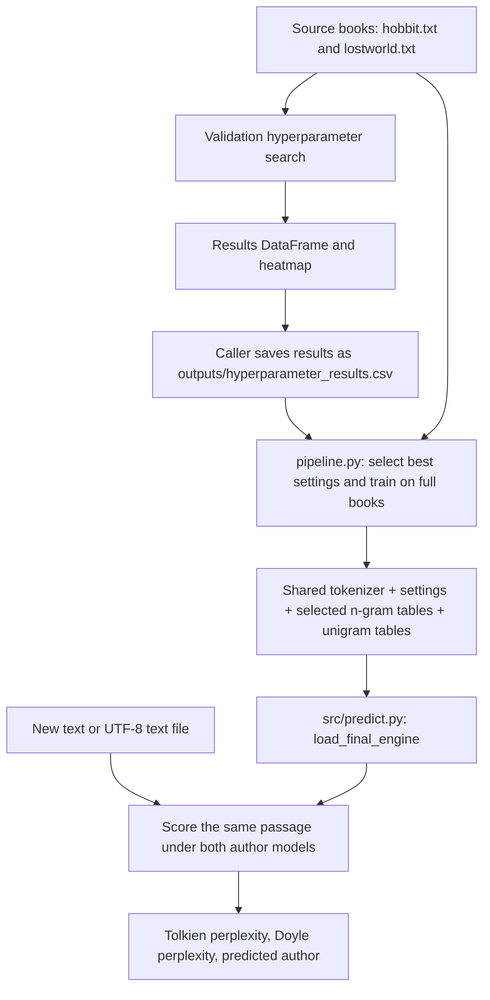
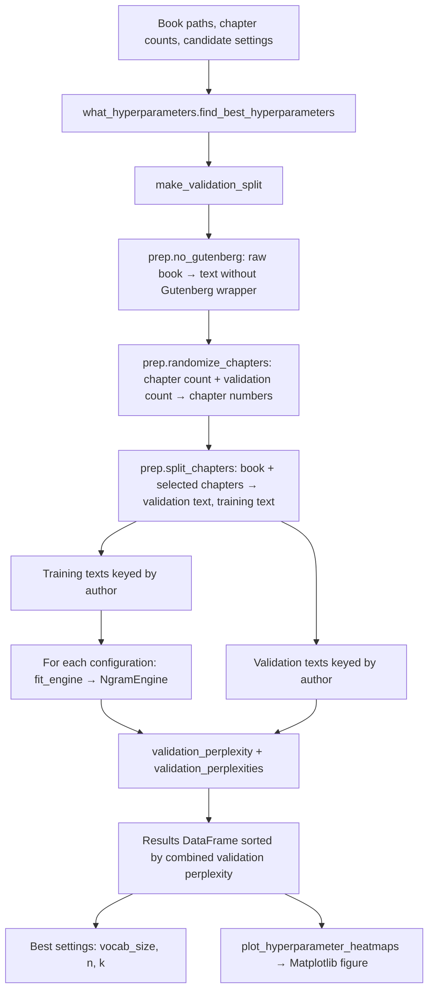
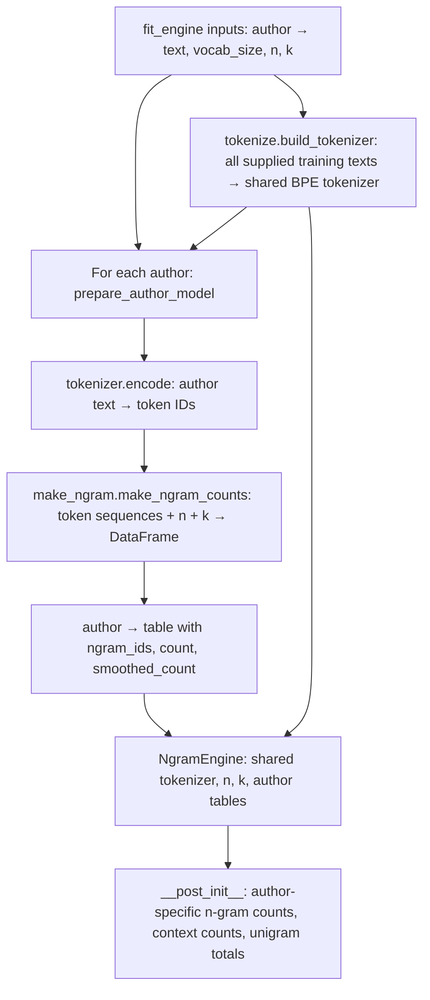
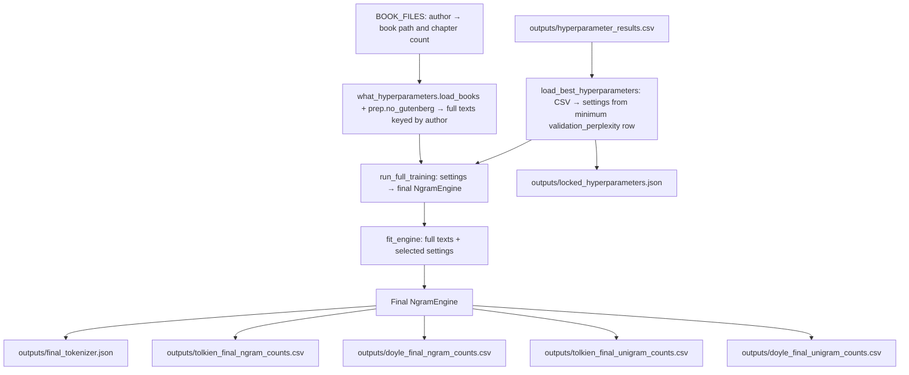
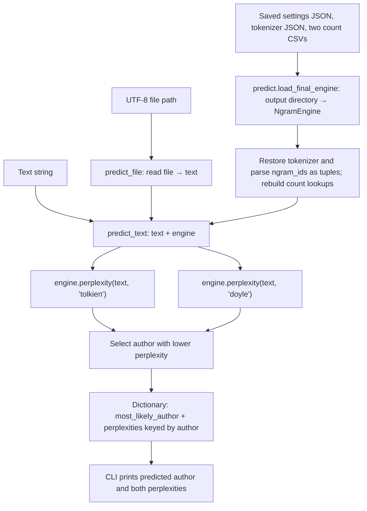
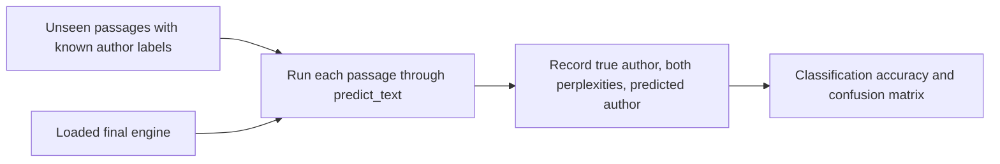

# Training and prediction pipelines

This document describes the current implementation. Mermaid diagrams render in
Markdown viewers with Mermaid support, including GitHub.

The system has **two separate author language models with one shared BPE
tokenizer and vocabulary**. Tolkien and Doyle have separate n-gram counts and
context counts. Both use the same selected vocabulary size, n-gram order (`n`),
and add-k smoothing value (`k`).

## Overall flow

## 1. Validation and hyperparameter search

Entry point: `pipeline.run_hyperparameter_search()`.

Inputs are `BOOK_FILES`, vocabulary sizes `[500, 1000, 1500, 3000]`, n-gram orders
`[2, 3]`, smoothing values `[0.01, 0.1, 0.5, 1.0]`, validation fraction `0.2`, and
random seed `42`. This evaluates 32 configurations.

Each validation text is evaluated under its **correct author's model**. The
combined metric aggregates log probabilities and word counts across authors;
it is not an arithmetic average of their perplexities. The search selects the
configuration with the lowest combined validation perplexity, not classification
accuracy.

The returned tuple is `(best_hyperparameters, results_df, heatmap_figure)`.
The search does not save these objects automatically. Save `results_df` to
`outputs/hyperparameter_results.csv` before running the final training script.

## 2. Model fitting shared by search and final training

`build_tokenizer()` uses whitespace pre-tokenization and BPE, with `[UNK]`,
`[BOS]`, and `[EOS]` registered as special tokens. The current fitting code does
not insert BOS/EOS markers. Each author's text is encoded as one sequence, so
n-grams can cross chapter boundaries.

The saved tables include `smoothed_count = count + k` for observed n-grams.
Scoring uses raw `count` and applies smoothing itself, including for unseen
n-grams.

## 3. Final training and saved outputs

Entry point: `python pipeline.py`.

The script reads existing search results; it does not call
`run_hyperparameter_search()` automatically. Final training fits a new shared
tokenizer and both author models on the full source books, including the chapters
previously used for validation. The selected settings remain fixed. The selected
n-gram tables are used for prediction, and the unigram tables are saved so the
final artifacts explicitly include unigram counts from the locked tokenizer.

## 4. Prediction

Entry point: `python -m src.predict --file path/to/passage.txt`, or
`python -m src.predict --text "A passage to classify."`.

For each author, `NgramEngine.score(text, author)`:

1. Encodes the passage with the shared tokenizer.
2. Looks up each n-gram and its preceding context in that author's counts.
3. Calculates `P(token | context) = (ngram_count + k) / (context_count + k * V)`,
   where `V` is the actual shared tokenizer vocabulary size.
4. Sums natural log probabilities and divides by the number of
   whitespace-delimited words in the passage.

`perplexity(text, author)` returns `exp(-score)`. This is **per-word normalized
perplexity**, based on BPE n-gram probabilities. Lower values indicate that the
author model assigns higher likelihood to that passage. The first `n - 1` tokens
are used as context without separate initial-token probabilities.

`NgramEngine.predict(text)` also returns the highest-scoring author, but
`predict_text()` directly compares perplexities so it can return both values.
If a passage has fewer than `n` tokens or no words, scoring returns negative
infinity and perplexity is infinity. The current prediction code does not reject
ties; it selects the first author encountered.

## 5. Held-out test evaluation: next stage

Batch test-set evaluation is not currently implemented. `predict_text()` already
provides the operation needed for each test passage.

Use test text excluded from tokenizer training, model training, and hyperparameter
selection. Because the current final training stage uses both full source books,
its test passages must come from separate material. To test on reserved chapters
from those books, change final training to exclude those chapters as well.

## Module and function reference

| Module | Function or class | Inputs | Outputs / role |
| --- | --- | --- | --- |
| `pipeline.py` | `data_in` | Book path, chapter count, split fraction | Dictionary with book-specific validation/train strings; helper not called by the main training path |
| `pipeline.py` | `run_hyperparameter_search` | Module configuration | Best settings, results DataFrame, heatmap figure |
| `pipeline.py` | `load_best_hyperparameters` | Results CSV path | Settings dictionary: `vocab_size`, `n`, `k` |
| `pipeline.py` | `run_full_training` | Selected settings | Final `NgramEngine` |
| `src/prep.py` | `no_gutenberg` | Raw book string | Book string without Gutenberg wrapper when present |
| `src/prep.py` | `randomize_chapters` | Total chapters, validation count | Selected chapter numbers |
| `src/prep.py` | `split_chapters` | Book string, selected chapter numbers | `(validation_text, training_text)` |
| `src/tokenize.py` | `build_tokenizer` | List of training strings, vocabulary size | Trained shared BPE tokenizer |
| `src/make_ngram.py` | `make_ngram_counts` | Token-ID sequences, `n`, `k` | Count DataFrame used by the engine |
| `src/make_ngram.py` | `grams` | Token-ID sequences, tokenizer, `n` | Decoded n-gram/count DataFrame for inspection; not used by engine fitting |
| `src/what_hyperparameters.py` | `load_books` | Author-keyed paths and chapter counts | Cleaned full texts keyed by author |
| `src/what_hyperparameters.py` | `make_validation_split` | Book configuration, validation fraction, seed | `(training_texts, validation_texts)` keyed by author |
| `src/what_hyperparameters.py` | `prepare_author_model` | Author text, shared tokenizer, `n`, `k` | One author's n-gram count table |
| `src/what_hyperparameters.py` | `fit_engine` | Training texts, vocabulary size, `n`, `k` | Shared tokenizer and separate author models in `NgramEngine` |
| `src/what_hyperparameters.py` | `NgramEngine` | Tokenizer, `n`, `k`, author tables | Count lookups and scoring/prediction methods |
| `src/what_hyperparameters.py` | `validation_perplexity` | Engine, validation texts | Combined correct-author validation perplexity |
| `src/what_hyperparameters.py` | `validation_perplexities` | Engine, validation texts | Correct-author validation perplexity per author |
| `src/what_hyperparameters.py` | `plot_hyperparameter_heatmaps` | Search results DataFrame | Matplotlib figure |
| `src/what_hyperparameters.py` | `find_best_hyperparameters` | Book configuration, candidate settings, split settings | Best settings, sorted results DataFrame, heatmap figure |
| `src/predict.py` | `load_final_engine` | Output directory, default `outputs` | Restored `NgramEngine` |
| `src/predict.py` | `predict_text` | Text string, engine | Predicted author and both perplexities |
| `src/predict.py` | `predict_file` | UTF-8 file path, engine | Same result as `predict_text` |

`src/eda.py` is currently empty and has no role in these pipelines.
